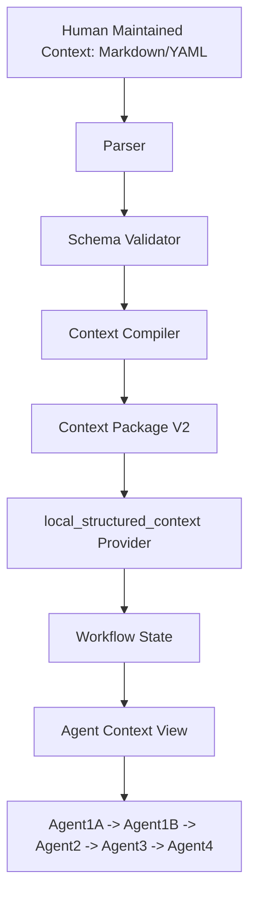

# Context Compiler Design Review

本文从当前 Multi-Agent 需求分析系统的实际问题出发，评审是否应在人工维护内容和 Runtime Context Package V2 之间增加一层 `Human Maintained Context Model -> Context Compiler -> Context Package V2`。

本文只做技术方案设计，不修改代码，不实现功能。

## 一、重新确认 Context 的目标

当前系统中的 Context 实际承担两类职责：

1. 作为需求分析辅助上下文：为当前需求提供历史系统背景、业务规则、限制、流程、待确认事项和来源。
2. 作为 Agent Runtime 输入层：被 `local_structured_context` Provider 读入 Workflow State，再转换成每个 Agent 的 Context View，最终渲染进 Agent 输入。

因此，Context 的定位应是：

- 主要是 `C. 需求分析辅助上下文`
- 在运行时表现为 `D. Agent Runtime 输入层`

它不应定位为：

- `A. 企业知识库`
- `B. 文档结构化系统`

原因是当前项目目标不是维护企业全部知识，而是辅助产品/测试人员完成需求理解、缺口识别、风险分析和验证关注点生成。Context 的价值只在于降低人工需求分析成本、提高风险识别质量、提升历史经验复用效率。

### Context 当前必须解决的问题

| 目标 | Context 应提供什么 | 业务价值 |
|---|---|---|
| 降低人工需求分析成本 | 相关历史背景、已有规则、当前未知项 | 减少人工翻文档和重复梳理 |
| 提供历史系统背景 | 功能现状、流程、限制、来源 | 让 Agent 不只基于当前抽象需求推断 |
| 提供规则和限制 | 已确认业务规则、禁止项、只读项、范围边界 | 减少宽泛缺口和无效问题 |
| 提供风险识别依据 | 已知 unknown、冲突、历史问题、规则缺口 | 提高风险分析具体性 |
| 提供验证关注点依据 | 业务规则、限制、异常场景、历史缺陷 | 让 Agent3 生成更贴近业务的验证方向 |

### 当前不属于目标的内容

- 全企业知识治理。
- 自动理解所有历史文档。
- 完整知识图谱。
- 自动维护业务事实。
- 让未经确认的模型推断直接成为企业事实。
- 让业务人员长期维护机器友好的 JSON Runtime Schema。

结论：Context 本身不是产品目标。它是需求分析和风险识别工作流的输入资产。

## 二、Structured Context V2 是否适合作为人工维护格式

当前 Context Package V2 的核心结构是：

- `confirmed_facts`
- `business_rules`
- `constraints`
- `process_flows`
- `unknowns`
- `source_refs`
- `quality_flags`

这套结构已经证明适合作为 Agent Runtime 输入，但不适合作为长期人工维护格式。

### 分项评价

| Section | 是否符合业务人员理解方式 | 是否方便长期维护 | 是否容易重复 | 是否容易遗漏关系 | 评价 |
|---|---|---|---|---|---|
| `confirmed_facts` | 一般。业务人员通常说“账号注册功能支持什么”，而不是先抽象成事实 | 一般，需要判断什么是事实、什么是规则 | 容易与规则重复，例如“支持手机号注册”和“注册需填写手机号” | 容易丢失所属功能场景 | 适合作为 Runtime 分类，不适合作为原始维护入口 |
| `business_rules` | 部分符合。规则是业务人员能理解的概念 | 中等，但需要人工拆 item、写 id、source_ref | 容易与流程、限制重复 | 容易忽略规则适用场景和版本 | 可作为人工维护内容的一部分，但不应直接等同 Runtime section |
| `constraints` | 符合。限制/禁止项是业务语言 | 中等，边界清晰时好维护 | 可能与规则重复，例如“手机号不可修改”既是限制也是资料规则 | 需要绑定对象和场景 | 适合作为人工模型字段，也适合作为 Runtime section |
| `process_flows` | 符合。业务通常按流程描述 | 人工可维护，但 JSON 中一条 flow 容易过长 | 与规则重复，例如“注册后重新登录”既是规则也是流程 | 如果拆成 item，会丢失步骤关系 | 人工应按步骤维护，Compiler 再生成 Runtime flow |
| `unknowns` | 符合。待确认事项是业务评审常见对象 | 适合人工维护 | 不容易重复，但容易过粗 | 需要绑定场景、责任人、状态 | 应作为人工模型中的“待确认事项”，Compiler 转 Runtime unknowns |

### 结论

Structured Context V2 应继续作为 Runtime Schema，而不是作为人工长期维护格式。

原因：

- JSON 维护成本高。
- V2 section 是机器消费视角，不是业务组织视角。
- 人工维护时天然围绕功能、场景、流程、角色、规则、风险，而不是 facts/rules/constraints 分类。
- 长期手写 V2 会让业务人员承担 Schema 整理工作，偏离“人工负责业务判断”的原则。

## 三、Human Context Model 设计

Human Context Model 应围绕业务对象、功能场景和需求模块组织。它可以用 Markdown、YAML 或更轻量的表格维护；第一版建议采用结构化 Markdown 或 YAML frontmatter + Markdown 内容，不要求业务人员手写 Context Package V2 JSON。

### 示例：账号注册功能

```yaml
module_id: account_registration
module_name: 账号注册功能
version: v2.1
status: active
effective_date: 2026-08-01
owner: account-product-team
change_reason: 明确手机号注册、短信验证码和注册后登录规则
source:
  path: docs/account/registration.md
  section: 账号注册功能
```

```markdown
## 功能目标
用户可以通过手机号注册账号。

## 业务对象
- 用户账号
- 手机号
- 短信验证码

## 用户角色
- 未注册用户

## 前置条件
- 用户未拥有当前手机号对应账号。

## 主流程
1. 用户填写手机号。
2. 系统校验手机号唯一性。
3. 系统发送短信验证码。
4. 用户完成验证码验证。
5. 注册成功。
6. 用户重新进入登录流程。

## 业务规则
- 手机号在系统内必须唯一。
- 注册过程需要短信验证码验证。
- 注册成功后不会自动登录。

## 限制条件
- 已注册手机号不能重复注册。

## 异常场景
- 手机号已存在。
- 短信验证码错误。
- 短信验证码过期。

## 风险关注点
- 验证码有效期未明确会影响注册安全和测试边界。
- 注册成功后是否自动登录容易与历史版本冲突。

## 历史问题
- 旧版本曾出现注册成功后状态误判为已登录的问题。

## 验证关注点
- 手机号唯一性校验。
- 短信验证码必填和错误处理。
- 注册成功后跳转登录流程。

## 未确认事项
- 短信验证码有效时间未确定。
- 短信验证码发送频率未确定。
- 验证失败后的处理规则未确定。
```

### 字段维护责任

| 字段 | 是否必须人工维护 | 可否自动生成 | 说明 |
|---|---:|---:|---|
| `module_id` | 是 | 可辅助生成 | 需要稳定标识业务模块 |
| `module_name` | 是 | 否 | 业务人员应明确功能名称 |
| `version` | 是 | 否 | 避免旧规则污染 |
| `status` | 是 | 否 | active/deprecated/draft 需要业务判断 |
| `effective_date` | 是 | 否 | 需要业务确认 |
| `owner` | 是 | 否 | 方便追责和后续确认 |
| `change_reason` | 建议维护 | 否 | 支撑版本理解 |
| 功能目标 | 是 | 可从文档草稿辅助提取 | 需要业务确认 |
| 业务对象 | 是 | 可辅助提取 | 影响规则和风险边界 |
| 用户角色 | 是 | 可辅助提取 | 影响权限和流程 |
| 前置条件 | 建议维护 | 可辅助提取 | 不完整时可进入 unknown |
| 主流程 | 是 | 可辅助提取 | 需要业务确认步骤顺序 |
| 业务规则 | 是 | 可辅助提取 | 必须人工确认后才可作为规则 |
| 限制条件 | 是 | 可辅助提取 | 必须人工确认 |
| 异常场景 | 建议维护 | 可辅助提取 | 可提升风险识别质量 |
| 风险关注点 | 建议维护 | 可由历史 Bug 辅助生成 | 高价值，但应人工确认优先级 |
| 历史问题 | 建议维护 | 可从 Bug 记录导入 | 应保留来源和状态 |
| 验证关注点 | 建议维护 | 可从测试资产导入 | 供 Agent3 使用 |
| 未确认事项 | 是 | 可辅助发现 | 必须明确为 unknown，不可转事实 |

## 四、人工职责边界

引入 Context Compiler 后，人工不应负责把内容整理成 AI Runtime Schema。人工应负责业务判断。

### 人工负责

- 确认业务规则是否真实有效。
- 确认当前有效版本。
- 解决冲突规则。
- 判断业务边界和适用范围。
- 确认风险优先级。
- 判断历史 Bug/测试经验是否适用于当前模块。
- 明确哪些内容仍是待确认事项。
- 对低可信、过期、范围不明内容做业务决策。

### 系统负责

- 解析人工维护文档。
- 校验必填字段。
- 生成稳定 item id。
- 生成 source_ref。
- 将人工模型编译为 Context Package V2。
- 将功能/场景组织转换为 Runtime section。
- 生成 Agent Context View。
- 保留 Trace 和消费记录。
- 阻止未确认、冲突、过期内容进入 Agent Runtime。

### 边界原则

人工不是格式整理员。人工负责判断“这条信息是否正确、是否当前有效、是否适用于当前需求”。系统负责把已经确认的信息转换成 Agent 可消费的格式。

这能直接降低人工需求分析成本，同时保留风险识别和历史经验复用所需的业务判断。

## 五、Context Compiler 流程设计



| 步骤 | 输入 | 输出 | 是否需要 LLM | 是否需要规则校验 |
|---|---|---|---|---|
| Human Maintained Context | 业务人员维护的 Markdown/YAML | 人类可读业务上下文 | 否 | 否 |
| Parser | Markdown/YAML 文件 | 中间 AST 或 dict | 否 | 是，解析格式 |
| Schema Validator | AST/dict | 校验结果、错误列表 | 否 | 是，必填字段、版本、状态、空 section |
| Context Compiler | 已校验业务模型 | Context Package V2 | 否，第一版不需要 | 是，字段映射、ID、source_ref、release gate |
| Context Package V2 | Runtime JSON | `local_structured_context` 可读取文件 | 否 | 是，沿用当前 V2 轻量校验 |
| Agent Context View | V2 structured_content | 每个 Agent 的 section view | 否 | 是，沿用当前 `AGENT_CONTEXT_SECTIONS` |
| Workflow | 原始需求 + Agent Context View | 五 Agent 输出 | 是，Agent 调用 LLM | 是，Pipeline 状态与 Trace |

第一版 Compiler 不需要 LLM。原因是人工维护模型本身已经是结构化业务判断，Compiler 只做确定性转换。LLM 可以作为后续辅助草拟工具，但不能把未确认内容直接编译为 `confirmed_facts` 或 `business_rules`。

### Human Model 到 V2 的映射

| Human Context Model 字段 | 编译到 Context Package V2 | 说明 |
|---|---|---|
| 功能目标 | `confirmed_facts` | 表达系统支持的能力 |
| 业务对象 | `confirmed_facts` 或 source metadata | 可作为事实或上下文描述 |
| 用户角色 | `confirmed_facts` | 支撑权限和流程分析 |
| 前置条件 | `business_rules` 或 `constraints` | 取决于是条件还是禁止项 |
| 主流程 | `process_flows` | 可按步骤合并或拆分 |
| 业务规则 | `business_rules` | 必须人工确认 |
| 限制条件 | `constraints` | 明确禁止、只读、不可直接执行 |
| 异常场景 | `unknowns` 或 `business_rules` | 已定义处理规则进 rules；未定义进 unknowns |
| 风险关注点 | 第一版不直接进入 V2 核心 section，或进入 `quality_flags` | 避免混淆规则与风险推理 |
| 历史问题 | 第一版可进入 `quality_flags`，后续可独立 Risk Context | 不应伪装成业务规则 |
| 验证关注点 | 第一版可进入 `quality_flags`，后续可独立 Validation Context | 不应污染 Agent1A 的需求事实 |
| 未确认事项 | `unknowns` | 必须保持 unknown 身份 |

## 六、版本管理设计

业务上下文需要版本，因为需求分析依赖“当前有效规则”。没有版本管理，历史规则会污染当前需求。

例如：

```text
v1: 手机号可以直接修改
v2: 手机号修改需要人工审核
```

如果当前需求分析使用了 v1 规则，就会错误降低风险或生成错误测试关注点。

### 建议版本字段

```yaml
version: v2.1
status: active
effective_date: 2026-08-01
deprecated_date:
owner: account-product-team
change_reason: 手机号修改流程增加人工审核
supersedes: v1.9
```

### 状态定义

| status | 含义 | 是否可进入 Runtime |
|---|---|---|
| `draft` | 草稿，未确认 | 否 |
| `active` | 当前有效 | 是 |
| `deprecated` | 已过期 | 否 |
| `conflicted` | 存在冲突，未解决 | 否 |
| `review_required` | 需要人工确认 | 否 |

### 避免历史规则污染的方式

- Compiler 只编译 `status=active` 的模块或条目。
- `deprecated`、`conflicted`、`review_required` 只能进入审核或质量报告，不进入 Agent Context View。
- 每个 Runtime item 保留 `version`, `effective_date`, `source_ref`, `owner`。
- 同一业务对象的冲突规则必须在编译前阻断，而不是交给 Agent 判断。

这与当前 Auto Context 的 release gate 一致：未经确认或状态不满足的内容不能进入可消费 Context。

## 七、历史需求、Bug、测试用例如何进入模型

历史资料不应全部混入同一种 Context。它们对 Agent 的作用不同。

| 资料类型 | 主要作用 | 应进入哪里 | 不应怎么做 |
|---|---|---|---|
| 历史需求 | 提供功能现状、规则、流程、限制、unknown | Business Context | 不应把旧需求自动当作当前有效事实 |
| 历史 Bug | 提供风险模式、异常场景、曾经出错的边界 | Risk Context | 不应直接混入 `business_rules` |
| 历史测试用例 | 提供验证关注点、回归范围、异常覆盖经验 | Validation Context | 不应直接变成需求事实 |

### 是否应拆成 Business / Risk / Validation Context

从职责边界看，应至少在人工模型中区分：

- Business Context：当前业务事实、规则、限制、流程、unknown。
- Risk Context：历史 Bug、事故、风险模式、风险优先级。
- Validation Context：历史测试关注点、回归范围、验收经验。

但第一版不必引入三套 Runtime Schema。可以先在 Human Context Model 中分区维护，再由 Compiler 选择性编译：

- Business Context -> 现有 Context Package V2 核心 section。
- Risk Context -> 暂时进入 `quality_flags` 或后续单独扩展，不污染业务规则。
- Validation Context -> 暂时进入 `quality_flags` 或后续单独扩展，不污染 Agent1A。

关键原则是：历史 Bug 和测试用例是经验材料，不是业务事实本身。

## 八、与当前五 Agent 的关系

不需要新增 Agent。

Human Context Model 编译为 Context Package V2 后，仍沿用当前 Agent Context View 分发：

| Agent | 应消费的信息 | 是否需要修改职责 |
|---|---|---|
| Agent1A | 业务事实、规则、限制、流程、unknown | 不需要。继续负责需求解析和动作缺口识别 |
| Agent1B | 已知规则摘要、限制、unknown、Agent1A specific unknowns | 不需要。继续负责澄清问题 |
| Agent2 | 规则、限制、流程、unknown、质量标记；后续可消费风险经验 | 不需要改职责。若引入 Risk Context，只是增强输入 |
| Agent3 | 规则、限制、流程、unknown、风险分析结果；后续可消费验证经验 | 不需要改职责。保持验证关注点，不扩展为完整测试平台 |
| Agent4 | 上游所有结果、source refs、quality flags、人审理由 | 不需要。继续负责汇总和人工复核判断 |

### 是否需要修改 Stage Contract

第一版 Context Compiler 不要求修改 Stage Contract。

原因：

- 当前 Agent Runtime 已能消费 Context Package V2。
- Agent1A -> Agent1B 已支持 `known_conditions`, `specific_unknowns`, `context_refs`。
- Compiler 的第一目标是降低人工维护 V2 JSON 的成本，而不是改变 Agent 间信息结构。

后续如果要让历史 Bug 和测试用例发挥更大价值，可能需要在 Agent2/Agent3 的输入契约中增加更明确的历史经验字段。但这不属于 Context Compiler 第一版范围。

## 九、最小实现范围

本次只规划，不实现。若后续实施，最小范围应控制在：

```text
人工维护格式
↓
Context Compiler
↓
现有 Context Package V2
↓
现有 local_structured_context
↓
现有 Workflow
```

### 需要新增或修改

| 类型 | 内容 | 目的 |
|---|---|---|
| 新增示例数据 | `data/human_context/account_registration.md` 或 `.yaml` | 提供业务人员可读维护格式 |
| 新增 Compiler 模块 | `core/context_compiler.py` | 将 Human Context Model 编译为 Context Package V2 |
| 新增 CLI | `compile_context.py` 或 `prepare_context.py compile` | 一条命令生成 Runtime JSON |
| 新增文档 | Human Context Model 维护说明 | 让业务人员知道维护什么，而不是维护 JSON |
| 新增校验 | 必填字段、版本状态、source_ref、unknown 不转事实 | 保证可消费上下文质量 |

### 不需要修改

- 不修改五 Agent。
- 不修改 Agent Prompt。
- 不修改 Pipeline 顺序。
- 不修改 `local_structured_context` Provider。
- 不修改 Agent Context View 机制。
- 不引入 RAG、数据库、知识图谱。
- 不引入自动文档理解平台。
- 不要求全自动生成 Context。

### 最小验收方式

使用同一个注册需求：

1. 人工维护一份 Human Context Markdown/YAML。
2. Compiler 生成 Context Package V2。
3. 用现有 `verify_workflow.py --mode structured` 或等价 `local_structured_context` 路径运行。
4. 对比人工手写 V2 JSON 与 Compiler 生成 V2 JSON：
   - Runtime section 是否一致。
   - item id 是否稳定。
   - source_ref 是否保留。
   - unknown 是否仍为 unknown。
   - Agent Context View 是否一致。
5. 观察是否降低人工维护成本：业务人员不再手写 JSON，只维护业务语义。

## 十、最终判断

### 1. Context Compiler 是否比 Auto Context 更符合当前项目目标

是，但二者解决的问题不同。

Context Compiler 更符合当前阶段目标，因为它直接解决“人工维护 Structured Context V2 成本高”的问题，同时不牺牲业务确认边界。它让人工维护业务模型，系统负责转换 Runtime Schema。

Auto Context 解决的是“从历史资料中自动找候选内容”的问题，价值也存在，但当前代码实际是关键词召回和规则抽取，质量仍依赖审核。它适合减少查找资料成本，不适合替代业务确认。

当前阶段更应该优先验证 Context Compiler：

- 是否降低人工需求分析成本：是，减少手写 JSON 和 Runtime 分类工作。
- 是否提高风险识别质量：间接提高，规则、限制、unknown 更稳定进入 Agent。
- 是否提升历史经验复用效率：是，历史规则和经验可按功能模块长期维护。

### 2. Structured Context V2 应该保留在哪里

Structured Context V2 应保留为 Agent Runtime Schema。

它适合机器消费：

- section 明确。
- item id 明确。
- source_ref 明确。
- Agent Context View 可按 section 分发。
- Trace 可记录 item 级消费。

它不适合作为业务人员直接维护的主格式。

### 3. 人工维护格式应该是什么

人工维护格式应是围绕业务模块/功能场景组织的 Human Context Model。

建议第一版采用：

- Markdown 主体，便于业务人员维护。
- YAML frontmatter，维护版本、状态、owner、effective_date。
- 固定业务章节：功能目标、业务对象、角色、前置条件、主流程、业务规则、限制条件、异常场景、风险关注点、历史问题、验证关注点、未确认事项。

这比直接维护 JSON 更符合业务人员思维。

### 4. 人工和 AI 的职责边界是什么

人工负责业务判断：

- 是否正确。
- 是否当前有效。
- 是否存在冲突。
- 是否适用于当前需求。
- 风险优先级是否合理。

系统负责格式转换：

- 解析文档。
- 校验字段。
- 生成 id。
- 保留 source_ref。
- 编译 Context Package V2。
- 生成 Agent Context View。
- 记录 Trace。

AI/Agent 负责阶段推理：

- 需求解析。
- 缺口识别。
- 澄清问题。
- 风险分析。
- 验证关注点。
- 汇总。

### 5. 下一步最小验证应该是什么

下一步最小验证不是继续扩展 Auto Context，也不是接入更多数据源，而是做一个 Context Compiler Spike：

```text
一份人工可读账号注册 Human Context
↓
确定性 Compiler
↓
Context Package V2
↓
现有 Structured Workflow
↓
对比手写 V2 JSON 的 Agent Context View 和输出差异
```

验收标准：

- 业务人员不需要手写 Context Package V2 JSON。
- Compiler 生成的 V2 能被现有 `local_structured_context` 读取。
- 原有五 Agent 顺序和 Prompt 不变。
- unknown 不会被编译成 confirmed fact 或 business rule。
- deprecated/conflicted/review_required 内容不会进入 Runtime。
- Agent Context View 与手写 V2 的关键规则、限制、流程、unknown 等价。

这一路径能在最小复杂度下验证三项业务价值：

- 降低人工需求分析成本：减少手工 JSON 整理。
- 提高风险识别质量：让规则、限制、unknown 更稳定进入风险分析。
- 提升历史经验复用效率：业务模块上下文可持续维护并编译复用。

## 技术负责人评审结论

建议引入 Context Compiler，但只作为轻量确定性转换层，不作为自动理解平台。

当前系统已经证明 Context Package V2 适合作为 Agent Runtime 输入。下一步的关键不是继续扩展 Context Package V2 的结构，而是把人工维护格式从机器 Schema 中解耦出来。

最终推荐边界：

```text
Human Context Model: 面向业务人员维护
Context Compiler: 面向系统转换和校验
Context Package V2: 面向 Agent Runtime 消费
Agent Workflow: 保持现有五阶段不变
```

不建议当前投入：

- 完整企业知识库。
- RAG 平台。
- 知识图谱。
- 自动维护业务事实。
- 大规模多数据源治理。
- 新增业务 Agent。

这些方向当前无法直接证明能降低人工需求分析成本、提高风险识别质量或提升历史经验复用效率。
