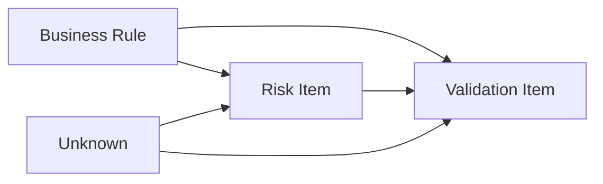

# Human Context Model V1 数据规范

本文定义 Human Context Model V1 的正式数据规范。该模型服务于当前 Multi-Agent 需求分析和风险识别系统，目标是让产品/测试人员维护业务判断，系统再通过 Context Compiler 转换为现有 Context Package V2 Runtime 输入。

本文不设计 RAG、知识库、Agent 平台或自动文档理解系统。

## 一、三类 Context 职责边界

Human Context Model V1 分为三类：

```text
Human Context Model V1
├─ Business Context V1
├─ Risk Context V1
└─ Validation Context V1
```

三类 Context 通过统一的 `module_id`、版本字段和 item 关联字段连接。

### 1. Business Context

Business Context 维护“当前业务事实、规则、流程、限制和待确认事项”。

应该进入 Business 的信息：

- 当前有效的功能目标。
- 业务对象。
- 用户角色。
- 前置条件。
- 主流程。
- 当前有效业务规则。
- 限制条件。
- 已定义异常处理。
- 未确认事项。
- 与业务规则直接相关的来源和版本。

禁止进入 Business 的信息：

- 未确认的模型推测。
- 已废弃历史规则。
- 历史 Bug 原文。
- 测试用例步骤。
- 测试经验总结。
- 风险判断结论，除非它已经被业务确认成规则或限制。

主要价值：

- 降低需求分析时重新整理规则的成本。
- 为 Agent1A/Agent1B 提供已知规则和具体 unknown。
- 为 Agent2/Agent3 提供规则、限制和流程依据。

### 2. Risk Context

Risk Context 维护“历史风险经验、历史问题和风险适用性判断”。

应该进入 Risk 的信息：

- 历史 Bug。
- 线上事故。
- 历史遗漏风险。
- 风险关注点。
- 风险触发条件。
- 影响范围。
- 风险优先级。
- 当前是否仍适用。
- 关联业务规则。

禁止进入 Risk 的信息：

- 当前业务规则正文的唯一维护副本。
- 未经确认的业务事实。
- 完整测试用例步骤。
- 与当前模块无关的历史 Bug。
- 已明确不再适用的历史问题，除非用于审计归档，不进入 Runtime。

主要价值：

- 提高 Agent2 风险识别质量。
- 让历史 Bug 从一次性记录变成可复用风险模式。
- 减少测试人员每次重新翻历史问题的成本。

### 3. Validation Context

Validation Context 维护“验证关注点、回归范围和测试经验”。

应该进入 Validation 的信息：

- 验证关注点。
- 回归范围。
- 历史遗漏测试点。
- 常见异常输入。
- 验收注意事项。
- 不适用范围。
- 关联风险和业务规则。

禁止进入 Validation 的信息：

- 业务规则的权威定义。
- 未确认业务决策。
- 历史 Bug 的完整治理记录。
- 自动生成但未经测试负责人确认的测试结论。
- 完整自动化测试平台配置。

主要价值：

- 支撑 Agent3 生成更贴近业务的验证关注点。
- 复用历史测试经验。
- 减少测试人员重复构思验证范围的成本。

## 二、通用 Metadata 规范

三类 Context 共享一组 metadata。

### 通用 metadata

| 字段 | 类型 | 必填 | 维护责任人 | 说明 |
|---|---|---:|---|---|
| `context_type` | enum | 是 | 系统模板，人工确认 | `business` / `risk` / `validation` |
| `module_id` | string | 是 | 产品负责人 | 稳定业务模块 ID，例如 `account_registration` |
| `module_name` | string | 是 | 产品负责人 | 人类可读模块名 |
| `version` | string | 是 | 维护责任人 | 当前上下文版本 |
| `status` | enum | 是 | 维护责任人 | `draft` / `active` / `deprecated` / `conflicted` / `review_required` |
| `effective_date` | date | 是 | 产品负责人 | 生效日期 |
| `deprecated_date` | date/null | 否 | 产品负责人 | 废弃日期 |
| `owner` | string | 是 | 维护责任人 | 业务或测试负责人 |
| `change_reason` | string | 否 | 维护责任人 | 本版本变更原因 |
| `source_refs` | list | 是 | 系统辅助，人工确认 | 来源文档、章节、链接或记录 ID |
| `tags` | list | 否 | 维护责任人 | 搜索和归类标签 |

### status 定义

| status | 含义 | 是否可编译进 Runtime |
|---|---|---:|
| `draft` | 草稿，未确认 | 否 |
| `active` | 当前有效 | 是 |
| `deprecated` | 已废弃 | 否 |
| `conflicted` | 存在未解决冲突 | 否 |
| `review_required` | 需要人工确认 | 否 |

## 三、Business Context V1 字段规范

### 结构

```yaml
context_type: business
module_id: string
module_name: string
version: string
status: active
effective_date: YYYY-MM-DD
deprecated_date:
owner: string
change_reason: string
source_refs: []
tags: []

business:
  functional_goal: string
  business_objects: []
  user_roles: []
  preconditions: []
  main_flow: []
  business_rules: []
  constraints: []
  defined_exception_handling: []
  unknowns: []
```

### 字段定义

| 字段 | 类型 | 必填 | 维护责任人 | 消费 Agent | 说明 |
|---|---|---:|---|---|---|
| `functional_goal` | string | 是 | 产品 | Agent1A、Agent4 | 模块目标，不写实现细节 |
| `business_objects` | list[object] | 是 | 产品，测试补充 | Agent1A、Agent2 | 业务对象及关键属性 |
| `user_roles` | list[object] | 是 | 产品 | Agent1A、Agent2 | 角色和权限边界 |
| `preconditions` | list[item] | 否 | 产品，测试补充 | Agent1A、Agent3 | 执行功能前必须满足的条件 |
| `main_flow` | list[step] | 是 | 产品 | Agent1A、Agent3 | 主流程步骤 |
| `business_rules` | list[BusinessRule] | 是 | 产品 | Agent1A、Agent1B、Agent2、Agent3 |
| `constraints` | list[item] | 是 | 产品，测试补充 | Agent1A、Agent2、Agent3 |
| `defined_exception_handling` | list[item] | 否 | 产品，测试补充 | Agent2、Agent3 |
| `unknowns` | list[item] | 是 | 产品，测试补充 | Agent1A、Agent1B、Agent2、Agent4 |

### BusinessRule

```yaml
- rule_id: rule_phone_unique
  title: 手机号唯一性
  statement: 手机号在系统内必须唯一。
  applies_to:
    - 用户通过手机号注册账号
  priority: high
  status: active
  source_refs:
    - docs/account/registration.md#注册规则
```

字段：

| 字段 | 必填 | 说明 |
|---|---:|---|
| `rule_id` | 是 | 稳定 ID，由系统可辅助生成，人工可读 |
| `title` | 是 | 规则短标题 |
| `statement` | 是 | 业务规则正文 |
| `applies_to` | 是 | 适用动作或场景 |
| `priority` | 否 | `high` / `medium` / `low` |
| `status` | 是 | 与通用 status 一致 |
| `source_refs` | 是 | 来源 |

## 四、Risk Context V1 字段规范

### 结构

```yaml
context_type: risk
module_id: string
module_name: string
version: string
status: active
effective_date: YYYY-MM-DD
owner: string
source_refs: []

risk:
  risk_items: []
```

### 字段定义

| 字段 | 类型 | 必填 | 维护责任人 | 消费 Agent | 说明 |
|---|---|---:|---|---|---|
| `risk_items` | list[RiskItem] | 是 | 测试负责人，产品/研发确认适用性 | Agent2、Agent4 | 历史问题和风险模式 |

### RiskItem

```yaml
- risk_id: risk_registration_auto_login_state
  title: 注册成功后登录态误判
  description: 历史版本曾出现注册成功后状态被误判为已登录。
  risk_type: state
  trigger_conditions:
    - 注册成功后跳转登录流程
  impact: 用户状态错误，可能绕过登录校验或导致页面状态异常。
  severity: high
  applicability: applicable
  related_rule_ids:
    - rule_no_auto_login_after_registration
  related_unknown_ids: []
  source_refs:
    - bug/ACCOUNT-1234
  status: active
```

字段：

| 字段 | 必填 | 说明 |
|---|---:|---|
| `risk_id` | 是 | 稳定风险 ID |
| `title` | 是 | 风险标题 |
| `description` | 是 | 风险描述 |
| `risk_type` | 是 | `state` / `permission` / `data` / `flow` / `performance` / `security` / `compatibility` |
| `trigger_conditions` | 否 | 触发条件 |
| `impact` | 是 | 影响 |
| `severity` | 是 | `high` / `medium` / `low` |
| `applicability` | 是 | `applicable` / `not_applicable` / `unknown` |
| `related_rule_ids` | 否 | 关联 Business Rule |
| `related_unknown_ids` | 否 | 关联 Business unknown |
| `source_refs` | 是 | Bug、事故、评审记录来源 |
| `status` | 是 | 是否当前有效 |

## 五、Validation Context V1 字段规范

### 结构

```yaml
context_type: validation
module_id: string
module_name: string
version: string
status: active
effective_date: YYYY-MM-DD
owner: string
source_refs: []

validation:
  validation_items: []
```

### 字段定义

| 字段 | 类型 | 必填 | 维护责任人 | 消费 Agent | 说明 |
|---|---|---:|---|---|---|
| `validation_items` | list[ValidationItem] | 是 | 测试负责人 | Agent3、Agent4 | 验证关注点和回归经验 |

### ValidationItem

```yaml
- validation_id: val_registration_login_state
  title: 注册成功后登录态验证
  focus: 验证注册成功后不会自动登录，并重新进入登录流程。
  validation_type: state_flow
  related_rule_ids:
    - rule_no_auto_login_after_registration
  related_risk_ids:
    - risk_registration_auto_login_state
  suggested_checks:
    - 注册成功后检查登录态为空或未登录。
    - 注册成功后检查页面进入登录流程。
  not_applicable_when: []
  source_refs:
    - test_asset/account_registration_regression.md
  status: active
```

字段：

| 字段 | 必填 | 说明 |
|---|---:|---|
| `validation_id` | 是 | 稳定验证项 ID |
| `title` | 是 | 验证关注点标题 |
| `focus` | 是 | 验证目标 |
| `validation_type` | 是 | `core_flow` / `edge_case` / `state_flow` / `permission` / `data` / `performance` / `regression` |
| `related_rule_ids` | 否 | 关联 Business Rule |
| `related_risk_ids` | 否 | 关联 Risk Item |
| `suggested_checks` | 否 | 建议检查点，不要求完整测试用例 |
| `not_applicable_when` | 否 | 不适用条件 |
| `source_refs` | 是 | 测试资产或评审记录来源 |
| `status` | 是 | 是否当前有效 |

## 六、关联关系设计

### 核心对象关系



### 关联原则

1. Business Rule 是规则源头。
2. Risk Item 可以关联一个或多个 Business Rule。
3. Risk Item 也可以关联 Unknown，表示风险来自信息未确认。
4. Validation Item 可以关联 Business Rule，表示验证已知规则。
5. Validation Item 可以关联 Risk Item，表示覆盖历史风险。
6. Validation Item 不应反向定义业务规则。

### 关联字段

| 来源对象 | 目标对象 | 字段 |
|---|---|---|
| Risk Item | Business Rule | `related_rule_ids` |
| Risk Item | Unknown | `related_unknown_ids` |
| Validation Item | Business Rule | `related_rule_ids` |
| Validation Item | Risk Item | `related_risk_ids` |
| Validation Item | Unknown | 可选 `related_unknown_ids` |

### 示例关系

```text
rule_no_auto_login_after_registration
↓
risk_registration_auto_login_state
↓
val_registration_login_state
```

解释：

- 业务规则说明注册后不自动登录。
- 历史风险说明过去曾误判登录态。
- 验证关注点要求检查注册成功后的登录态和跳转流程。

## 七、版本机制

### 版本设计目标

版本机制用于避免旧规则污染当前需求分析，并让历史经验可以被审计和回溯。

### 新需求

处理规则：

- 新模块初始 `status=draft`。
- 业务规则确认后改为 `active`。
- 未确认事项保留在 `unknowns`，不能转为规则。
- Compiler 只编译 `active` 的规则、限制、流程和明确 unknown。

### 规则变更

处理规则：

- 新建新版本，不直接覆盖旧版本。
- 旧规则标记为 `deprecated`。
- 新规则标记为 `active`。
- `change_reason` 必须说明变更原因。
- 与新规则冲突的旧规则不得进入 Runtime。

### 历史规则废弃

处理规则：

- 设置 `status=deprecated`。
- 填写 `deprecated_date`。
- 保留 source_refs 供审计。
- 不进入 Agent Context View。

### Bug 经验更新

处理规则：

- 如果 Bug 仍可能复现，Risk Item 保持 `active`。
- 如果 Bug 已由规则或系统设计彻底消除，Risk Item 标记为 `deprecated` 或 `not_applicable`。
- 如果是否仍适用无法判断，`applicability=unknown`，不直接作为高置信风险输入。
- Validation Item 可继续保留为回归关注点，但需标记适用范围。

### 编译准入原则

进入 Runtime 的内容必须满足：

```text
status = active
source_refs 不为空
无 unresolved conflict
业务规则已人工确认
历史风险 applicability = applicable
验证项 status = active
```

## 八、账号注册模块完整示例

### Business Context

```yaml
context_type: business
module_id: account_registration
module_name: 账号注册
version: business-v2.1
status: active
effective_date: 2026-08-01
deprecated_date:
owner: account-product-team
change_reason: 明确手机号注册、短信验证码和注册后登录规则
source_refs:
  - docs/account/registration.md#账号注册
tags:
  - account
  - registration

business:
  functional_goal: 用户可以通过手机号注册账号。
  business_objects:
    - object_id: obj_user_account
      name: 用户账号
    - object_id: obj_phone
      name: 手机号
    - object_id: obj_sms_code
      name: 短信验证码
  user_roles:
    - role_id: role_unregistered_user
      name: 未注册用户
  preconditions:
    - id: pre_phone_available
      text: 用户填写的手机号未被其他账号占用。
      source_refs:
        - docs/account/registration.md#前置条件
  main_flow:
    - step_id: step_enter_phone
      text: 用户填写手机号。
    - step_id: step_check_unique
      text: 系统校验手机号唯一性。
    - step_id: step_send_sms
      text: 系统发送短信验证码。
    - step_id: step_verify_sms
      text: 用户完成短信验证码验证。
    - step_id: step_register_success
      text: 注册成功。
    - step_id: step_go_login
      text: 用户重新进入登录流程。
  business_rules:
    - rule_id: rule_phone_required_for_registration
      title: 注册必须填写手机号
      statement: 用户注册时需要填写手机号。
      applies_to:
        - 用户通过手机号注册账号
      priority: high
      status: active
      source_refs:
        - docs/account/registration.md#业务规则
    - rule_id: rule_phone_unique
      title: 手机号唯一
      statement: 手机号在系统内必须唯一。
      applies_to:
        - 用户通过手机号注册账号
      priority: high
      status: active
      source_refs:
        - docs/account/registration.md#业务规则
    - rule_id: rule_sms_verification_required
      title: 注册需要短信验证码
      statement: 注册过程需要进行短信验证码验证。
      applies_to:
        - 用户通过手机号注册账号
      priority: high
      status: active
      source_refs:
        - docs/account/registration.md#业务规则
    - rule_id: rule_no_auto_login_after_registration
      title: 注册后不自动登录
      statement: 注册成功后不会自动登录，需要用户重新进入登录流程。
      applies_to:
        - 用户通过手机号注册账号
        - 用户登录
      priority: medium
      status: active
      source_refs:
        - docs/account/registration.md#业务规则
  constraints:
    - id: constraint_duplicate_phone_forbidden
      text: 已注册手机号不能重复注册。
      applies_to:
        - 用户通过手机号注册账号
      source_refs:
        - docs/account/registration.md#限制条件
  defined_exception_handling:
    - id: exception_phone_exists
      text: 手机号已存在时，系统应阻止注册。
      applies_to:
        - 用户通过手机号注册账号
      source_refs:
        - docs/account/registration.md#异常处理
  unknowns:
    - unknown_id: unknown_sms_expiry
      text: 短信验证码有效时间未确定。
      applies_to:
        - 用户通过手机号注册账号
      source_refs:
        - docs/account/registration.md#未确认事项
    - unknown_id: unknown_sms_rate_limit
      text: 短信验证码发送频率未确定。
      applies_to:
        - 用户通过手机号注册账号
      source_refs:
        - docs/account/registration.md#未确认事项
    - unknown_id: unknown_sms_failure_handling
      text: 验证失败后的处理规则未确定。
      applies_to:
        - 用户通过手机号注册账号
      source_refs:
        - docs/account/registration.md#未确认事项
```

### Risk Context

```yaml
context_type: risk
module_id: account_registration
module_name: 账号注册
version: risk-v1.0
status: active
effective_date: 2026-08-01
owner: qa-team
source_refs:
  - bug/ACCOUNT-1234
  - bug/ACCOUNT-1299

risk:
  risk_items:
    - risk_id: risk_registration_auto_login_state
      title: 注册成功后登录态误判
      description: 历史版本曾出现注册成功后状态被误判为已登录。
      risk_type: state
      trigger_conditions:
        - 注册成功后重新进入登录流程
      impact: 用户状态错误，可能导致页面状态异常或绕过登录判断。
      severity: high
      applicability: applicable
      related_rule_ids:
        - rule_no_auto_login_after_registration
      related_unknown_ids: []
      source_refs:
        - bug/ACCOUNT-1234
      status: active
    - risk_id: risk_sms_policy_missing
      title: 短信验证码策略缺失
      description: 验证码有效期、发送频率和失败处理未定义时，容易造成安全和体验风险。
      risk_type: security
      trigger_conditions:
        - 使用短信验证码注册
      impact: 可能出现暴力请求、验证码过期处理不一致或失败重试边界不清。
      severity: high
      applicability: applicable
      related_rule_ids:
        - rule_sms_verification_required
      related_unknown_ids:
        - unknown_sms_expiry
        - unknown_sms_rate_limit
        - unknown_sms_failure_handling
      source_refs:
        - review/security-sms-policy.md
      status: active
```

### Validation Context

```yaml
context_type: validation
module_id: account_registration
module_name: 账号注册
version: validation-v1.0
status: active
effective_date: 2026-08-01
owner: qa-team
source_refs:
  - test_asset/account_registration_regression.md

validation:
  validation_items:
    - validation_id: val_phone_unique_registration
      title: 手机号唯一性验证
      focus: 验证已注册手机号不能重复注册。
      validation_type: core_flow
      related_rule_ids:
        - rule_phone_unique
      related_risk_ids: []
      suggested_checks:
        - 使用已注册手机号提交注册。
        - 检查系统阻止重复注册。
      not_applicable_when: []
      source_refs:
        - test_asset/account_registration_regression.md#手机号唯一性
      status: active
    - validation_id: val_sms_verification_required
      title: 短信验证码必需验证
      focus: 验证注册流程必须完成短信验证码校验。
      validation_type: core_flow
      related_rule_ids:
        - rule_sms_verification_required
      related_risk_ids:
        - risk_sms_policy_missing
      suggested_checks:
        - 不填写验证码提交注册。
        - 填写错误验证码提交注册。
        - 验证码规则未知时标记为待确认测试关注点。
      not_applicable_when: []
      source_refs:
        - test_asset/account_registration_regression.md#短信验证码
      status: active
    - validation_id: val_registration_login_state
      title: 注册成功后登录态验证
      focus: 验证注册成功后不会自动登录，并重新进入登录流程。
      validation_type: state_flow
      related_rule_ids:
        - rule_no_auto_login_after_registration
      related_risk_ids:
        - risk_registration_auto_login_state
      suggested_checks:
        - 注册成功后检查用户未处于已登录态。
        - 注册成功后检查页面进入登录流程。
      not_applicable_when: []
      source_refs:
        - test_asset/account_registration_regression.md#登录态
      status: active
```

## 九、业务价值评估

### 是否降低人工需求分析成本

可以降低，但降低的是整理和复用成本，不是业务判断成本。

降低的成本：

- 不再手写 Runtime JSON。
- 不再每次从零梳理功能规则。
- 不再把历史 Bug 和测试经验散落在不同文档里靠人工记忆。
- 规则、风险、验证关注点通过 ID 关联，减少重复查找。

不能降低的成本：

- 业务规则确认。
- 当前版本有效性判断。
- 冲突解决。
- 风险是否适用于当前需求的判断。

### 是否提高风险识别质量

可以提高。

原因：

- Business Context 给 Agent2 提供明确规则、限制和 unknown。
- Risk Context 给 Agent2 提供历史问题和风险模式。
- 规则与风险通过 `related_rule_ids` 关联，风险不再只来自模型泛化推断。
- unknown 与风险通过 `related_unknown_ids` 关联，能区分“真实缺失信息”与“模型猜测风险”。

### 是否提升历史经验复用效率

可以提升。

原因：

- 历史需求沉淀到 Business Context。
- 历史 Bug 沉淀到 Risk Context。
- 历史测试经验沉淀到 Validation Context。
- 三者通过 `module_id` 和关联 ID 复用，不需要建设完整知识库。

## 十、最终结论

Human Context Model V1 应采用三类上下文：

```text
Business Context V1: 维护当前业务事实、规则、限制、流程、unknown
Risk Context V1: 维护历史风险、Bug、事故和适用性判断
Validation Context V1: 维护验证关注点、回归范围和测试经验
```

Structured Context V2 继续作为 Agent Runtime Schema，不作为人工维护格式。

该模型符合当前项目定位：辅助需求分析和风险识别，而不是建设知识库。它的核心价值是让人工维护业务判断，让系统负责转换和分发，从而降低需求分析准备成本，提高风险识别质量，并提升历史经验复用效率。
