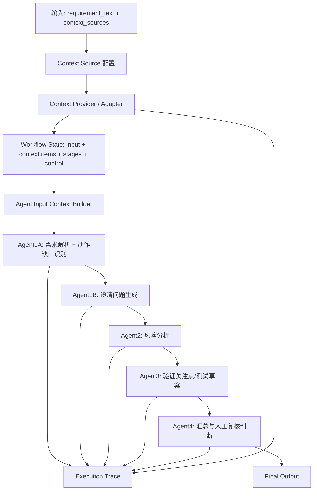

# Multi-Agent 需求分析系统信息流审计

> 文档状态：Historical / Superseded。
>
> 本文保留为 2026-08-07 信息流审计材料。当前 Agent 与 Context contract 以 `docs/agent_context_contract.md` 为准；其中 Agent1B 的 Context visibility 已收敛为 indirect-only，不直接消费完整 Context View。

本文基于当前代码、Prompt、Schema 和已有 Trace/评估产物，对系统中的信息产生、传递、转换和消费方式做审计。本文只描述当前真实链路，不提出平台化扩展，不修改代码。

## 一、当前完整信息流



| 步骤 | 输入字段 | 输出字段 | 数据结构 | LLM处理 | 规则处理 | 是否保留来源信息 |
|---|---|---|---|---|---|---|
| 用户输入 | `case_id`, `requirement_text`, `context_sources` | `workflow_state.input.requirement_text`, context source 配置 | Dict | 否 | 配置读取 | 原始需求以 `workflow_state.input.requirement_text` 保留 |
| Context Source | `type`, `path`, `required`, provider 配置 | 标准 context item / package | Dict | 否 | 按 source type 选择 provider | 保留 source path、provider、status |
| Markdown Provider | 本地 Markdown 路径 | raw markdown context item | Context Package V1 风格 | 否 | 文件读取、失败策略 | 保留文件路径；不形成 item 级业务来源 |
| Structured Provider | 本地 Context Package V2 JSON | `structured_content` | Context Package V2 | 否 | 轻量 schema 校验 | 保留 `id`, `source_ref`, section |
| Auto Context Preparation | `data/history` 历史文档、当前需求 | index、review queue、consumable context | JSON artifacts | 否，当前为确定性抽取/匹配 | 索引、召回、抽取、审核门控、gold label 评估 | 保留文件路径、标题、行号；候选与可消费内容隔离 |
| Workflow State | 原始需求、context items、stage 状态 | 当前阶段、stage artifact、失败原因、人审标记 | Dict | 否 | 状态机和 required/optional 策略 | 保留 context item 和 stage 输入引用 |
| Agent Input Builder | `requirement_text`, `context.items` | `context_view`, `rendered_agent_input`, `context_consumption`, `final_input_sources` | Dict + rendered text | 否 | section 分发、安全门控、渲染 | Trace 中保留 Context section 和 item id |
| Agent1A | `rendered_agent_input` | `functional_goal`, `user_roles`, `main_flow`, `preconditions`, `edge_cases`, `action_gap_candidates` | JSON | 是 | 输出 normalize；Structured 时做 Action-Context Alignment | `context_refs` 可保留 item id；source_ref 不进入业务输出 |
| Agent1B | 原始需求渲染文本、`main_flow`, `action_gap_candidates`, `unassigned_unknowns` | `open_questions`, `question_sources` | JSON | 是 | `specific_unknowns` 存在时优先确定性转问题 | `question_sources.context_refs` 保留 item id |
| Agent2 | 原始需求渲染文本、Agent1A、Agent1B | `ambiguity_risks`, `missing_info`, `edge_case_risks`, `permission_risks`, `data_risks`, `performance_risks` | JSON | 是 | JSON normalize | 风险结果没有一等来源字段 |
| Agent3 | 原始需求渲染文本、Agent1A、Agent2 | `core_test_points`, `edge_test_points`, `performance_test_points`, `acceptance_criteria`, `test_case_drafts` | JSON | 是 | JSON normalize | 测试输出没有一等来源字段 |
| Agent4 | 原始需求渲染文本、Agent1A/1B/2/3 | `requirement_summary`, `risk_summary`, `test_recommendation`, `human_review_required`, `critical_open_questions` | JSON | 是 | JSON normalize、人审状态汇总 | 最终业务摘要不稳定保留 context source；Trace 保留 |
| Trace | Tool/Skill/Agent 调用上下文 | `workflow_events.jsonl`, `agent_traces.jsonl`, `tool_traces.jsonl` | JSONL | 否 | 旁路记录 | 保留最完整的信息消费记录 |

当前 Pipeline 固定执行顺序是 Agent1A -> Agent1B -> Agent2 -> Agent3 -> Agent4。Context View 在每个 Agent 执行前生成，原始 `requirement_text` 不被覆盖；实际给 Agent 的输入是临时生成的 `rendered_agent_input`。

## 二、Context 信息流分析

| 来源 | 处理方式 | 最终消费者 | 是否保留来源 | 存在问题 |
|---|---|---|---|---|
| Text | 仅使用 `requirement_text`，无 Context Provider | 五个 Agent 都通过各自 payload 消费原始需求 | 保留原始需求引用 | 没有历史规则、约束、流程、unknown，风险和测试关注点只能基于当前文本推断 |
| Markdown | 本地 Markdown 被读取为原始上下文；非 Structured 路径下主要拼接进 Agent1A 输入 | Agent1A 直接消费全文；Agent1B/2/3/4 主要消费 Agent1A 压缩后的结构化输出 | 文件路径和 Tool Trace 保留；业务 item 级来源不足 | 原始信息由 Agent1A 一次性理解和压缩，下游无法稳定知道某条规则来自哪一段 Markdown |
| Structured Context V2 | JSON 中的 `confirmed_facts`, `business_rules`, `constraints`, `process_flows`, `unknowns`, `source_refs`, `quality_flags` 被转换为各 Agent 的 Context View | Agent1A/2/3/4 按 `AGENT_CONTEXT_SECTIONS` 消费不同 section；Agent1B 只通过 Agent1A Artifact 间接继承来源 | item id、section、source_ref 可进入 Context View 和 Trace | 业务输出本身仍不强制携带 source_ref；Agent1B 的 Context visibility 是 indirect-only |
| Auto Context | 历史文档先生成 index，再生成 review queue，经人工审核后 build consumable Context Package；Workflow 中复用 Structured 路径 | 审核通过后的 consumable items 作为 Structured Context 被 Agent1A/2/3/4 通过各自 Agent Context View 直接消费；Agent1B 仅通过 Agent1A Artifact 间接获得缺口相关信息 | source path、heading、line_range、审核状态、gold label 评估产物保留 | review queue 中候选不会进入 Agent，这是正确隔离；历史风险和历史测试关注点目前没有一等 section |

### Text 模式

Text 模式的信息入口只有 `requirement_text`。Pipeline 为每个 Agent 构造 plain input context，`rendered_agent_input` 等于原始需求文本，`context_view.sections` 为空，`context_consumption` 为空。

这条路径最稳定，但信息最少。Agent1A 能拆出主流程和显性缺口，Agent1B 能生成澄清问题，Agent2/3 能继续推导风险和验证关注点，但所有判断都缺少历史系统事实支撑。

### Markdown 模式

Markdown 通过本地读取 Tool 进入 Workflow State。非 Structured 路径下，Pipeline 使用 legacy Agent1A 输入构造方式，将 Markdown 内容拼接到 Agent1A 的需求输入中。下游并不直接消费 Markdown 全文，而是消费 Agent1A 输出的 `main_flow`、`action_gap_candidates` 等结构。

这意味着 Markdown 的信息边界由 Agent1A 决定：Agent1A 没有抽出的规则、限制或 unknown，下游通常不会再看到。Markdown 的文件来源可以在 Trace 中看到，但业务信息没有稳定 item id，因此下游无法形成 item 级 `context_consumption`。

### Structured Context V2

Structured 模式把 Context Package V2 转成 Agent Context View。当前 section 分发如下：

| Agent | 消费 section |
|---|---|
| Agent1A | `confirmed_facts`, `business_rules`, `constraints`, `process_flows`, `unknowns` |
| Agent1B | none；不直接消费完整 Context View，只通过 Agent1A Artifact 间接继承 `context_refs` |
| Agent2 | `confirmed_facts`, `business_rules`, `constraints`, `process_flows`, `unknowns`, `quality_flags` |
| Agent3 | `confirmed_facts`, `business_rules`, `constraints`, `process_flows`, `unknowns` |
| Agent4 | `confirmed_facts`, `business_rules`, `constraints`, `process_flows`, `unknowns`, `source_refs`, `quality_flags` |

Structured 模式的信息流比 Markdown 稳定：每个 Agent 的 Trace 可以看到 Context View、消费 section、消费 item id 和最终输入来源。主要限制是：Agent 的业务输出 schema 并没有要求每条风险、问题或测试关注点都携带 source_ref，因此来源主要停留在 Trace 层，而不是最终业务结果层。

### Auto Context 模式

Auto Context 在 Workflow 之前执行：

```text
历史 Markdown/TXT
↓
context index
↓
requirement retrieval
↓
review queue
↓
人工审核
↓
consumable Context Package V2
↓
local_structured_context
↓
Structured Workflow
```

这条链路的关键设计是隔离：候选、冲突、过期、范围不明和未审核内容只能存在于 review queue，不能进入 Agent Context View。审核通过后的 consumable package 继续复用 Structured Context 路径，因此没有给五 Agent 增加新的下游流程。

## 三、逐 Agent 输入输出分析

### Agent1A

输入：

- `requirement_text` 参数，实际内容是 `rendered_agent_input`。
- Text 模式下等于原始需求。
- Markdown 模式下可能包含拼接后的 Markdown 原文。
- Structured/Auto Context 模式下包含原始需求和 Agent1A 专属 Context View。

输出：

- `functional_goal`
- `user_roles`
- `main_flow`
- `preconditions`
- `edge_cases`
- `action_gap_candidates`

消费字段：

- 原始需求中的目标、角色、动作、前置条件、边界条件。
- Context View 中的已确认事实、业务规则、限制、流程、unknown。
- Structured 模式下，unknown 只能作为“已知未知项”，进入 `specific_unknowns`，不能进入 `known_conditions`。

产生的信息：

- 当前需求的主流程。
- 每个动作的缺口候选。
- 每个动作已知条件：`known_conditions`。
- 每个动作具体未知项：`specific_unknowns`。
- 相关 Context item 引用：`context_refs`。
- Structured 模式下还可能产生 action alignment 和 unassigned unknowns。

下游使用：

- Agent1B 使用 `main_flow`, `action_gap_candidates`, `unassigned_unknowns` 生成澄清问题。
- Agent2 使用 Agent1A 结果识别风险。
- Agent3 使用 Agent1A 结果生成验证关注点。
- Agent4 使用 Agent1A 结果做最终汇总。

信息损耗：

- Markdown 原文只在 Agent1A 直接消费，下游依赖 Agent1A 是否成功抽取。
- `source_ref` 通常不会进入 Agent1A 业务输出，只可能以 `context_refs` 的 item id 形式保留。

### Agent1B

输入：

- 原始需求渲染文本。
- `main_flow`
- `action_gap_candidates`
- `unassigned_unknowns`
- Agent1B 不直接消费完整 Context View；Structured 模式下只能通过 Agent1A Artifact 间接继承 context_refs。

输出：

- `open_questions`
- `question_sources`

消费字段：

- 优先消费 `action_gap_candidates[].specific_unknowns`。
- 使用 `known_conditions` 避免重复询问已回答事项。
- 使用 `context_refs` 记录问题来源。
- 为 `unassigned_unknowns` 生成问题时不伪造业务归属。

产生的信息：

- 面向人工澄清的问题列表。
- 每个问题对应的动作、specific unknown、context refs 和是否未分配。

下游使用：

- Agent2 优先基于 `agent_1_questions.open_questions` 生成 `missing_info`。
- Agent4 直接复用 `agent_1_questions.open_questions` 作为 `critical_open_questions`。

信息损耗：

- `question_sources` 虽然被传给下游，但 Agent2 Prompt 的重点是 `open_questions`，来源字段对风险分类没有一等约束。
- Agent4 最终输出复用问题文本，但不保证复用问题来源。

### Agent2

输入：

- 原始需求渲染文本。
- Agent1A 的需求解析结果。
- Agent1B 的澄清问题结果。
- Structured 模式下的 Agent2 Context View。

输出：

- `ambiguity_risks`
- `missing_info`
- `edge_case_risks`
- `permission_risks`
- `data_risks`
- `performance_risks`

消费字段：

- `agent_1_questions.open_questions` 是 missing info 的优先来源。
- Agent1A 的 main flow、缺口、已知规则、unknown 作为风险推导依据。
- Context View 中的规则、限制、流程、unknown、quality flags 可被模型阅读。

产生的信息：

- 信息不明确风险。
- 缺失信息。
- 异常流程、权限、数据、性能风险。

下游使用：

- Agent3 使用 Agent2 风险生成验证关注点。
- Agent4 使用 Agent2 风险做风险汇总和人审判断。

信息损耗：

- 当前风险 schema 没有 `risk_source_refs` 或 `context_refs`，因此风险与具体 Context item 的关系主要停留在 Trace 的输入侧。
- 历史风险模式当前没有一等输入位置；如果历史 Bug 只作为普通规则进入，Agent2 难以区分“规则”与“历史风险经验”。

### Agent3

输入：

- 原始需求渲染文本。
- Agent1A 的需求解析结果。
- Agent2 的风险分析结果。
- Structured 模式下的 Agent3 Context View。

输出：

- `core_test_points`
- `edge_test_points`
- `performance_test_points`
- `acceptance_criteria`
- `test_case_drafts`

消费字段：

- 已定义的规则和限制用于形成具体测试点。
- 未定义内容只能形成测试关注方向或“当前无法设计具体用例草案”。
- 风险结果是异常、边界和性能关注点的主要来源。

产生的信息：

- 核心验证关注点。
- 异常验证关注点。
- 性能验证关注点。
- 验收标准。
- 受控测试草案。

下游使用：

- Agent4 汇总测试建议。

信息损耗：

- 当前输出没有明确记录每个测试点来自哪个风险、规则或 Context item。
- 历史测试用例或历史测试关注点没有一等输入位置，只能作为普通 Context 文本被模型阅读。

### Agent4

输入：

- 原始需求渲染文本。
- Agent1A 需求解析。
- Agent1B 澄清问题。
- Agent2 风险分析。
- Agent3 测试设计。
- Structured 模式下的 Agent4 Context View。

输出：

- `requirement_summary`
- `risk_summary`
- `test_recommendation`
- `human_review_required`
- `critical_open_questions`

消费字段：

- 上游全部业务结果。
- Agent1B 的 `open_questions`。
- Agent2 风险。
- Agent3 测试关注点。
- Context View 中的 source refs 和 quality flags。

产生的信息：

- 最终面向人工阅读的需求、风险、测试建议汇总。
- 是否需要人工复核。
- 关键待确认问题。

下游使用：

- 作为最终输出。
- Trace 和 Workflow State 记录最终状态。

信息损耗：

- 最终摘要不保证携带 item 级来源。
- `critical_open_questions` 只复用问题文本，不保证携带 `question_sources`。

## 四、信息损耗分析

| 信息 | 产生位置 | 理论消费者 | 实际消费者 | 是否丢失 |
|---|---|---|---|---|
| 原始 `requirement_text` | 用户输入 / Workflow State | 五个 Agent、Trace、Final Output | 五个 Agent 都通过渲染输入消费 | 未丢失 |
| Markdown 原文 | Markdown Provider | Agent1A 及可能的下游 | Agent1A 直接消费；下游主要消费 Agent1A 压缩结果 | 部分压缩 |
| Markdown 文件路径 | Context Package / Tool Trace | 人工审计、最终复核 | Trace 可见；业务输出不稳定出现 | 业务输出侧丢失 |
| `confirmed_facts` | Structured/Auto Context | Agent1A/2/3/4；Agent1B indirect-only | 按 Context View 分发；Agent1B 通过 Agent1A Artifact 间接获得相关结论 | 未明显丢失 |
| `business_rules` | Structured/Auto Context | Agent1A/2/3/4；Agent1B indirect-only | 按 Context View 分发；Agent1B 通过 Agent1A `known_conditions` 间接获得相关结论 | 未明显丢失，但最终输出不强制引用来源 |
| `constraints` | Structured/Auto Context | Agent1A/2/3/4；Agent1B indirect-only | 按 Context View 分发；Agent1B 通过 Agent1A Artifact 间接获得相关结论 | 未明显丢失 |
| `process_flows` | Structured/Auto Context | Agent1A/2/3/4；Agent1B 只可能通过 Agent1A Artifact 间接受益 | Agent1B 当前不消费 `process_flows` | 对 Agent1B 直接不可见，符合 indirect-only contract |
| `unknowns` | Structured/Auto Context | Agent1A/2/3/4；Agent1B indirect-only | 按 Context View 分发；Agent1A 转成 `specific_unknowns` 后供 Agent1B 使用 | 未明显丢失 |
| `source_ref` | Context item | 人工复核、Agent4、Trace | Context View 和 Trace 可见；Agent2/3 业务输出不强制保留 | 业务结论侧丢失 |
| `applies_to_candidates` | Auto Context / Structured Context | Agent1A Action Alignment | Context View、Alignment、Trace | 未明显丢失 |
| `known_conditions` | Agent1A | Agent1B/2/3/4 | 下游通过 Agent1A parsing result 消费 | 未明显丢失，但会被摘要压缩 |
| `specific_unknowns` | Agent1A | Agent1B/2/4 | Agent1B 直接转澄清问题；Agent2/4 可通过结果消费 | 未明显丢失 |
| `question_sources` | Agent1B | Agent2、Agent4、人工复核 | 作为 question_result 传递，但下游 Prompt 不强制使用来源 | 消费不足 |
| Agent2 风险分类 | Agent2 | Agent3、Agent4 | Agent3/4 消费 | 未明显丢失 |
| Agent3 测试关注点 | Agent3 | Agent4、最终用户 | Agent4 消费 | 未明显丢失 |
| 历史风险信息 | 当前 Context 没有独立 section | Agent2 | 没有一等输入位置 | 输入缺失 |
| 历史测试关注点/测试用例 | 当前 Context 没有独立 section | Agent3 | 没有一等输入位置 | 输入缺失 |
| review queue 中被拒绝或未审核候选 | Auto Context Preparation | 人工审核和质量评估 | 不进入 Agent Context View | 未丢失，属于正确隔离 |

## 五、上下游契约分析

### Agent1A -> Agent1B

当前传递字段：

- `main_flow`
- `action_gap_candidates`
- `known_conditions`
- `specific_unknowns`
- `context_refs`
- `unassigned_unknowns`

判断：

- 对“把具体 unknown 转为澄清问题”来说，当前契约基本足够。
- 质量依赖 Agent1A 是否把 Context item 正确分配到动作，以及是否把已知规则放入 `known_conditions`。
- 如果某些流程信息只在 `process_flows` 中，而 Agent1B 的 Context View 不包含 `process_flows`，Agent1B 只能通过 Agent1A 的压缩结果间接知道这类信息。

问题类型：

- 不是 Agent 职责错误。
- 主要是 `C. 输出格式不足` 和 `D. 信息消费错误` 的组合：当 Agent1A 没有把某条信息写入 `known_conditions` 或 `specific_unknowns`，Agent1B 无法稳定恢复。

### Agent1A/Agent1B -> Agent2

当前传递字段：

- Agent1A 完整 parsing result。
- Agent1B `open_questions` 和 `question_sources`。
- Structured 模式下 Agent2 自己的 Context View。

判断：

- 对普通风险分析来说，字段足够支撑“缺失信息风险”和“规则边界风险”。
- 对历史经验复用来说，字段不足：历史 Bug、历史事故、历史测试遗漏没有一等输入位置。
- Agent2 输出 schema 没有来源字段，因此即使输入侧有 Context item，输出侧也不稳定保留“哪个风险来自哪个历史资料”。

问题类型：

- 主要是 `B. 输入不足` 和 `C. 输出格式不足`。
- 不是 Agent2 职责错误；Agent2 的风险分析职责合理，但它目前缺少历史风险模式这种输入材料。

### Agent2 -> Agent3

当前传递字段：

- Agent2 风险分类。
- Agent1A 需求解析。
- 原始需求渲染文本。
- Structured 模式下 Agent3 自己的 Context View。

判断：

- 对验证关注点生成来说，当前链路能工作。
- 对“复用历史测试关注点”来说，当前信息不足。
- Agent3 输出没有把测试点与风险或 Context item 显式关联，最终人工只能从文本判断来源。

问题类型：

- 主要是 `B. 输入不足` 和 `C. 输出格式不足`。
- 不应判断为 Agent3 职责错误。当前 Agent3 更适合保持“验证关注点/受控测试草案”，而不是扩展成完整测试用例生成器。

### 汇总判断

当前问题不属于需要增加 Agent 的问题。更准确地说，它属于上下游信息契约和消费边界问题：

- Context 到 Agent 的输入已经可观察，但业务输出没有稳定继承来源。
- Agent1A 到 Agent1B 的具体 unknown 链路已经建立，但仍依赖 Agent1A 的动作归属和字段填充质量。
- Agent2/3 缺少历史风险和历史测试经验的明确信息入口。

## 六、Context 和 Agent 职责边界

### Context 当前应该负责什么

Context 应该负责提供可消费的信息资产：

- 当前需求相关的历史资料。
- 已确认事实、业务规则、限制条件、流程、unknown。
- 来源文件、标题、行号、版本、冲突、可信度、审核状态。
- 给不同 Agent 的 Context View。
- 不让未审核候选进入 Agent Context View。

Context 不应该负责：

- 代替业务人员确认事实。
- 代替 Agent 做风险推理。
- 自动补全未知业务规则。
- 把所有企业文档维护成完整知识库。

### Agent 当前应该负责什么

Agent 应该负责在自己的阶段内消费信息并生成阶段产物：

- Agent1A：把当前需求和 Context 转成主流程、已知条件、具体 unknown、动作缺口。
- Agent1B：把具体 unknown 转成人工澄清问题。
- Agent2：基于需求、缺口和规则识别风险。
- Agent3：基于需求和风险生成验证关注点。
- Agent4：汇总结果并判断是否需要人工复核。

Agent 不应该负责：

- 扫描历史文档。
- 判断文档版本是否有效。
- 批准候选上下文。
- 自行把未确认内容当作企业事实。

### 历史资料应该进入哪里

| 历史资料类型 | 当前适合进入的位置 | 当前状态 |
|---|---|---|
| 历史需求 | Context Source / Auto Context，转为事实、规则、限制、流程、unknown | 已有基础链路 |
| 历史 Bug | 理论上应作为风险经验供 Agent2 消费 | 当前没有一等结构，只能混入普通 Context |
| 历史测试用例/测试关注点 | 理论上应作为验证经验供 Agent3 消费 | 当前没有一等结构，只能混入普通 Context |
| 设计说明 | Context Source / Auto Context，转为规则、约束、流程、source refs | 已有基础链路 |

这里不需要新增 Agent。问题是某些历史经验类型尚未在现有 Context 和 Stage Contract 中被明确表达。

## 七、最终结论

### 1. 当前系统最大的信息流问题

最大问题不是 Context 无法进入 Workflow，而是“信息进入后，在阶段输出和最终结果中没有稳定保留来源与语义边界”。

具体表现：

- Markdown 信息进入后主要由 Agent1A 压缩，下游无法直接消费 item 级来源。
- Structured/Auto Context 能记录 item 级消费，但 Agent2/3/4 的业务输出不强制保留 context refs。
- 历史风险和历史测试经验没有一等输入位置，难以稳定转化为风险和验证关注点。

### 2. 是否需要修改 Agent 架构

当前不需要修改 Agent 架构，也不需要新增 Agent。

五个 Agent 的职责链路基本成立：需求解析 -> 澄清问题 -> 风险分析 -> 验证关注点 -> 汇总。当前问题主要发生在信息契约、Context View 分发和来源继承，不是 Agent 数量不足。

### 3. 是否主要是上下游输入输出契约问题

是。当前主要问题是上下游输入输出契约问题：

- Agent1A 必须稳定把 Context 中的已知规则和具体 unknown 保留到 action 级字段。
- Agent1B 必须稳定使用 `specific_unknowns` 和 `question_sources`，避免退回宽泛问题。
- Agent2/3 需要能区分“当前需求推导”与“历史经验输入”，否则历史资料只能作为普通文本被阅读。
- Agent4 需要能在最终结果中体现人工复核依据，但目前来源信息主要停留在 Trace。

### 4. 下一步最小改动应该优化哪里

如果继续做最小改动，优先点应是现有链路内的信息保真，而不是扩展新系统：

1. 收敛 Agent2/Agent3 的输入消费边界，明确哪些 Context section 会影响风险和验证关注点。
2. 在现有 Trace 和 Stage Artifact 中审计 source_ref/context_refs 是否从 Context View 传到关键业务结论。
3. 检查 Agent1B 是否存在因 indirect-only 可见性和 Agent1A 压缩不足导致的重复提问。
4. 保持 Auto Context 的候选隔离，继续用审核后的 consumable package 进入 Structured 链路。

这四项都属于现有信息流审计和契约收敛，不需要扩展成 RAG、知识库、知识图谱或 Agent 平台。
