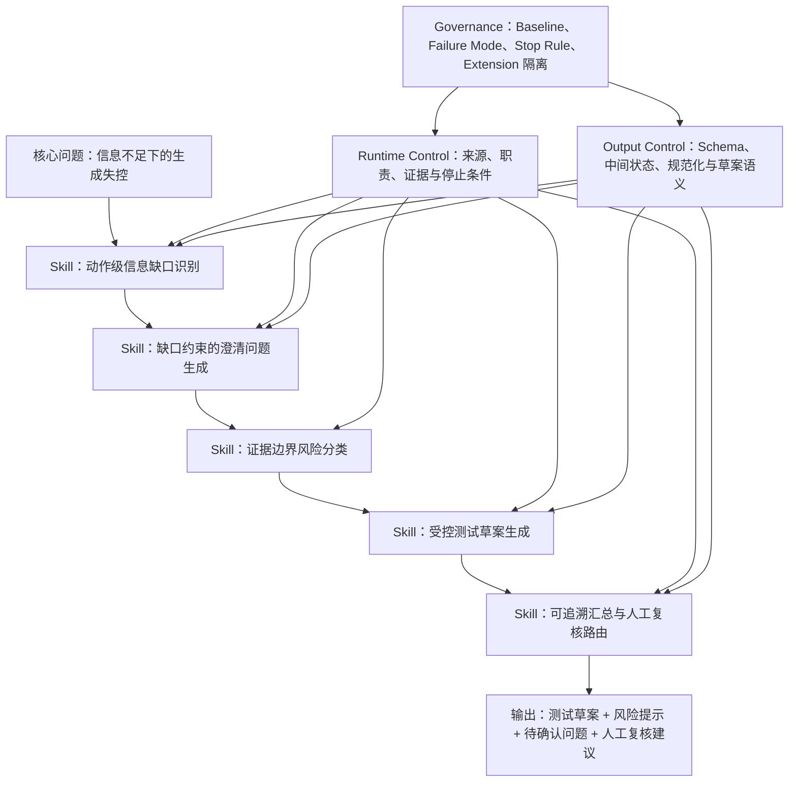

# 项目二资产地图

## 文档定位

本地图按能力层组织项目资产，不按代码目录或 Agent 编号组织。

项目的正式定位是：

> 将需求理解、风险识别、测试设计和汇总复核结构化为 AI Workflow，并通过分阶段约束，在信息不足时暴露缺口、停止伪完整生成，输出可追溯、可复核的测试设计草案。

项目不以证明“多 Agent 一定优于单 Prompt”为目标，也不定位为完整测试用例自动生成系统。

### 状态标记

| 状态 | 含义 |
|---|---|
| 已实现 | 已进入当前可运行链路，存在代码、Prompt 和实际输出证据 |
| 部分实现 | 已有部分代码或流程，但仍依赖模型遵循、人工执行，或缺少完整闭环 |
| 文档定义 | 已形成明确规则并在实验中使用，但未实现为自动化机制 |
| 设计阶段 | 只定义了后续方向，当前版本未实现 |

---

## 1. 核心问题

项目处理的核心问题不是“模型能否生成内容”，而是“模型生成过程是否可靠”。

### 1.1 需求信息不完整

单段需求通常缺少流程、规则、范围、输入输出边界、页面信息和异常处理。模型容易将这些缺失内容自动补全为已知事实。

### 1.2 风险分析泛化

模型容易输出权限、性能、安全、数据一致性等通用 checklist，而不是只分析当前需求有证据支持的风险。

### 1.3 伪完整测试

当需求信息不足时，模型仍可能生成完整步骤、输入值、错误提示和验收规则，使结果看似完整但不可执行。

### 1.4 阶段职责污染

解析阶段可能提前设计方案，风险阶段可能补充业务机制，测试阶段可能假设实现方式，汇总阶段可能重新扩写问题。

### 1.5 输出质量缺少判断基线

仅凭人工直觉观察输出，无法稳定判断结果属于正确、遗漏、越界还是过度收敛。

### 1.6 Prompt 调优可能破坏全局稳定性

局部规则增加可能修复一个 Case，却在其他 Case 或下游阶段产生回归。系统需要停止条件、Baseline 和扩展隔离。

---

## 2. 核心能力

### 能力总图



### 2.1 核心 Skill

| Skill | 解决的问题 | 核心产物 | 状态 |
|---|---|---|---|
| 动作级信息缺口识别 | 防止动作遗漏和常识补全 | `main_flow`、`action_gap_candidates` | 已实现 |
| 缺口约束的澄清问题生成 | 防止问题泛滥、重复和脱离证据 | `open_questions` | 已实现 |
| 证据边界风险分类 | 防止风险分析变成通用 checklist | 六类风险数组 | 已实现 |
| 信息不足时的受控测试草案生成 | 防止伪完整测试用例 | 测试点、验收条件、`test_case_drafts` | 已实现 |
| 可追溯汇总与人工复核路由 | 防止汇总扩写和未经确认的结果下放 | 摘要、关键问题、`human_review_required` | 部分实现 |

### 2.2 支撑 Skill

| Skill | 作用 | 状态 |
|---|---|---|
| 结构化输出规范化与字段兜底 | 处理 Markdown fence、类型错误、非法枚举和字段缺失 | 部分实现 |
| Expected Behavior 行为边界评测 | 判断动作遗漏、越界补全、风险泛化、伪完整生成和汇总漂移 | 部分实现，人工执行 |
| Failure-Mode 驱动的收敛与 Baseline 隔离 | 指导何时继续调优、调整结构、冻结 Baseline 或进入扩展 | 文档定义，有实践记录 |

### 2.3 基础设施能力

| 能力 | 作用 | 状态 |
|---|---|---|
| 可重复多案例回归实验 | 固定输入、批量运行、记录模式、按 `run_id` 归档结果 | 已实现 |

---

## 3. Agent 层

Agent 层负责承接真实测试工作流中的不同职责。Agent 的价值不在数量，而在于提供独立输入、输出和责任边界。

### 3.1 需求事实与动作缺口分析 Agent

- **职责**：提取需求中明确存在的事实和动作，并逐动作识别主要信息缺口。
- **输入**：`requirement_text`。
- **输出**：目标、角色、主流程、前置条件、边界情况、`action_gap_candidates`。
- **关键边界**：不生成澄清问题，不引入原文不存在的规则、角色或实现方式。
- **状态**：已实现。

### 3.2 缺口驱动澄清问题生成 Agent

- **职责**：将已识别的动作缺口转换为有限、抽象、去重后的问题。
- **输入**：需求文本、`main_flow`、`action_gap_candidates`。
- **输出**：`open_questions`。
- **关键边界**：不能重新判断或新增缺口类型，不能脱离候选集合自由提问。
- **状态**：已实现。

### 3.3 证据约束风险审查 Agent

- **职责**：只基于需求和澄清问题识别有证据支持的风险。
- **输入**：需求文本、需求解析结果、澄清问题。
- **输出**：歧义、缺失信息、边界、权限、数据和性能风险。
- **关键边界**：不输出通用 checklist，不引入具体异常原因、解决方案或指标。
- **状态**：已实现。

### 3.4 受控测试草案设计 Agent

- **职责**：将已知需求和风险转换为测试关注点，在信息不足时停止完整生成。
- **输入**：需求文本、解析结果、风险结果。
- **输出**：核心测试点、边界测试点、性能关注点、验收条件、`test_case_drafts`。
- **关键边界**：不补充步骤、输入值、错误文案、实现方式和具体阈值。
- **状态**：已实现。

### 3.5 可追溯结果汇总与复核路由 Agent

- **职责**：汇总既有结果，并标识是否需要人工复核。
- **输入**：需求、解析、问题、风险和测试草案。
- **输出**：需求摘要、风险摘要、测试建议、关键问题、`human_review_required`。
- **关键边界**：不新增、改写或具体化上游问题，不新增风险和测试方向。
- **状态**：部分实现。Agent 已运行，但人工复核标志由模型判断，尚无确定性规则引擎或审批工作流。

### 3.6 澄清问题收敛 Agent

- **职责**：对已有 `open_questions` 进行去重、合并和数量控制。
- **输入**：需求文本和已有问题集。
- **输出**：收敛后的 `open_questions`。
- **关键边界**：只能筛选已有问题，不能创造新的问题类型。
- **状态**：部分实现，属于默认关闭的兼容实验分支；与当前新解析结果存在输入契约不匹配，不属于稳定主链路。

### 未纳入 Agent 资产的内容

- 旧版 `workflows/run_pipeline.py` 中的四阶段实现与现行职责重复，不重复计为新 Agent。
- 双通道风险扩展存在代码骨架，但对应 Prompt 资源缺失且未接入主链路，不计为当前可复用 Agent。
- Harness、评测规则和 Context Layer 分别属于基础设施、治理或设计资产，不包装为 Agent。

---

## 4. 约束层

约束层由 Runtime Control 和 Output Control 组成，是项目形成输出可靠性的核心。

## 4.1 Runtime Control

### 信息来源控制

- 每个阶段只能读取允许的输入。
- 不允许基于常识、行业经验或典型产品设计补全信息。
- 风险必须来源于需求文本或已暴露的问题。

**状态：已实现。** 主要通过 Prompt 生效，缺少统一确定性后置审计。

### 职责边界控制

- 解析阶段不生成问题或方案。
- 问题生成阶段不重新判断缺口。
- 风险阶段不提出解决方案。
- 测试阶段不补全需求。
- 汇总阶段不重新分析。

**状态：已实现。** 由串行架构和阶段 Prompt 共同约束。

### 动作覆盖控制

- 先提取 `main_flow`，再遍历全部动作。
- 不允许只选择部分动作进行缺口判断。
- 代码会为遗漏的动作补齐默认候选项。

**状态：已实现。** 同时存在 Prompt 规则和代码兜底。

### 风险证据门控

- 风险必须与当前需求或 `open_questions` 直接相关。
- 每个问题只进入一个最直接风险类别。
- 无依据的风险类别返回空数组。

**状态：已实现。** 主要依赖模型遵循，尚无自动证据核验器。

### 停止完整生成

```text
Information Missing
→ Expose Open Questions
→ Stop Complete Generation
```

- 信息不足时保留测试方向和草案语义。
- 禁止为了填满字段虚构完整测试步骤。

**状态：已实现为 Prompt 和 Schema 机制。** 尚无独立 Stop Controller。

### 人工复核触发

- 存在待确认问题、缺失信息、边界风险或不完整草案时，应标记人工复核。

**状态：部分实现。** 已有字段和判断规则，但由模型输出，未实现确定性计算和审批流程。

## 4.2 Output Control

### 固定结构化输出

- 各阶段只输出 JSON。
- 每个阶段具有固定字段和空值表达。
- 阶段输出作为下游的明确数据契约。

**状态：部分实现。** Prompt 中已定义 Schema，但没有统一 JSON Schema 校验器。

### 中间状态可观测性

关键中间状态包括：

- `main_flow`
- `action_gap_candidates`
- `open_questions`
- 分类风险
- `test_case_drafts`
- `critical_open_questions`
- `human_review_required`

这些字段让系统可以定位问题发生在哪一阶段，避免只观察最终文本。

**状态：已实现。** 已进入实际 Pipeline 输出。

### 草案语义控制

- 使用 `test_case_drafts`，而不是 `test_cases`。
- 输出对象被明确定位为人工参考和后续补充输入，而非可直接执行结果。

**状态：已实现。** 属于 Schema 与产品语义共同约束。

### 汇总可追溯控制

- `critical_open_questions` 只能复用上游问题。
- 汇总不能新增风险、问题或测试方向。

**状态：部分实现。** Prompt 规则已存在，但没有自动溯源比对器。

### 输出解析与最小兜底

- 清理 Markdown fence。
- 解析 JSON。
- 检查字段类型和缺口枚举。
- 补齐遗漏动作和空字段。

**状态：部分实现。** 前两个阶段较完整，风险、测试和汇总阶段主要只有 JSON 解析。

---

## 5. 治理层

治理层不直接生成业务结果，而是判断系统如何验证、收敛和控制变更。

### 5.1 Expected Behavior Baseline

为每类 Case 预先定义：

- 必须识别的动作
- 必须暴露的问题意图
- 禁止补全的假设
- 允许和禁止的风险
- 是否允许测试草案
- 是否禁止完整用例
- 是否必须人工复核

输出通过人工对照标记为 `PASS / PARTIAL / FAIL`。

**状态：部分实现。** 已有六类案例和评估规则，但主要依赖人工判断，不是自动评分系统。

### 5.2 Failure Mode 体系

项目定义六类典型失控模式：

1. Implicit Completion
2. Risk Generalization
3. Pseudo-complete Testing
4. Role Contamination
5. Single-stage Parsing Instability
6. Summary Drift

该体系用于将 Badcase 从“单个 Prompt 问题”提升为可归类的系统问题。

**状态：文档定义。** 有实验案例和收敛记录，未实现自动分类器。

### 5.3 最小多案例回归

- 每次调整 Prompt、Schema 或 Agent 结构后，至少复测三个代表性 Case。
- 对照 Expected Behavior Baseline 判断是否产生回归。
- 记录失败发生在哪个阶段。

**状态：部分实现。** Harness 可批量运行并归档，质量对照与结论记录仍依赖人工。

### 5.4 Prompt Stop Rule

当同类问题连续修改多次仍不稳定时，不再继续堆叠 Prompt，而是判断：

- 是否属于 Prompt 问题
- 是否属于 Schema 问题
- 是否属于任务结构问题
- 是否只出现在单个 Case
- 修改收益是否高于副作用
- 当前版本是否已经达到展示目标

**状态：文档定义。** 已用于项目收敛决策，但没有自动执行机制。

### 5.5 Baseline Freeze

当 Prompt 边际收益下降、问题跨 Case 迁移或修改影响下游时，冻结当前 Baseline。

**状态：部分实现。** 文档记录冻结决策，配置支持 Baseline 与扩展分支，但没有版本锁定和自动保护。

### 5.6 Extension 隔离

新能力应满足：

- 默认关闭
- 不影响 Baseline 可运行
- 失败时可绕过
- 仅在明确验证目标下启用

**状态：部分实现。** 已有扩展目录、配置开关和条件分支，但部分扩展不完整或存在输入契约问题。

### 5.7 Context Layer 边界

Context Layer 计划提供项目背景、业务规则、页面信息、系统关系、行业信息和历史缺陷，用于提升真实业务准确性。

**状态：设计阶段。** 当前明确不实现，不应作为现有能力或验证系统的一部分。

---

## 6. 当前实现状态

### 已实现

- 串行需求到测试设计 Workflow
- 动作级信息缺口识别
- 缺口驱动澄清问题生成
- 证据约束风险分类
- 受控测试草案生成
- 各阶段信息来源和职责边界 Prompt
- 中间状态与结构化结果输出
- 多案例 Harness、运行模式记录和结果归档

### 部分实现

- 人工复核触发：有字段和规则，缺少确定性判断与审批流
- Schema 校验：有字段契约，缺少统一校验器
- 输出规范化：前两阶段较完整，后续阶段较弱
- Expected Behavior Baseline：有规则和案例，依赖人工执行
- 多案例回归：可批量运行，缺少自动对照、Diff 和评分
- Baseline Freeze：有决策和开关，缺少版本保护
- Extension 隔离：有结构和配置，部分扩展不完整

### 文档定义

- 六类 Failure Mode 分类体系
- Prompt Stop Rule
- 分层判断 Prompt、Schema、Architecture、Process 问题的方法
- 人工 `PASS / PARTIAL / FAIL` 判定流程

### 设计阶段

- Context Layer
- 基于真实业务上下文的准确性评测
- 完整自动评测系统
- 自动证据溯源、风险核验和人工审批工作流

---

## 7. 面试表达价值

### 7.1 从“做了多 Agent”升级为“治理生成失控”

推荐表达：

> 这个项目不是简单把任务拆成四个 Agent，而是先从 Badcase 中识别补全、泛化、伪完整和汇总漂移，再用 Prompt、Schema、Architecture、Process 四层机制控制输出边界。

体现能力：问题抽象、系统设计、LLM 可靠性意识。

### 7.2 展示中间状态设计

推荐表达：

> 我没有让模型直接生成问题，而是引入 `action_gap_candidates`，先识别动作，再识别每个动作的缺口，最后决定哪些缺口进入 `open_questions`。

体现能力：结构化推理、可观测性、可解释性和问题定位。

### 7.3 展示停止生成机制

推荐表达：

> 在测试设计场景中，错误的完整结果比不完整草案更危险。因此信息不足时系统输出 `test_case_drafts` 和待确认问题，而不是虚构完整测试步骤。

体现能力：产品判断、风险意识、输出可靠性设计。

### 7.4 展示评测意识，但不夸大自动化

推荐表达：

> 项目建立了 Expected Behavior Baseline，用动作覆盖、禁止假设、风险相关性和停止生成等规则人工标记 PASS、PARTIAL、FAIL。它不是自动评分系统，而是轻量行为边界基线。

体现能力：诚实区分评测基线与自动评测系统，避免能力包装过度。

### 7.5 展示 LLM 系统迭代治理

推荐表达：

> 当 Prompt 修改开始出现边际收益下降和跨 Case 回归时，我没有继续堆规则，而是冻结 Baseline，并通过默认关闭的 Extension 隔离实验能力。

体现能力：回归意识、版本治理、实验设计和工程取舍。

### 7.6 最值得展示的资产组合

```text
动作级缺口识别
→ 证据边界风险分类
→ 受控测试草案生成
→ 人工复核路由
→ Expected Behavior Baseline
```

该组合完整表达了项目主线：

> 识别不确定性，限制错误传播，在信息不足时停止伪完整生成，并通过人工基线验证输出是否守住边界。

---

## 项目资产结论

项目二最有价值的资产不是某个单独 Agent，而是一套围绕输出可靠性形成的能力体系：

```text
Skill 提供可复用处理机制
Agent 承接阶段职责
Runtime Control 限制生成行为
Output Control 固定结果语义与数据契约
Governance 负责评测、收敛和变更隔离
```

当前项目已经形成可运行的约束型 Workflow 和人工可复核的实验闭环，但尚未形成完整自动评测、确定性审批或真实业务 Context Layer。
